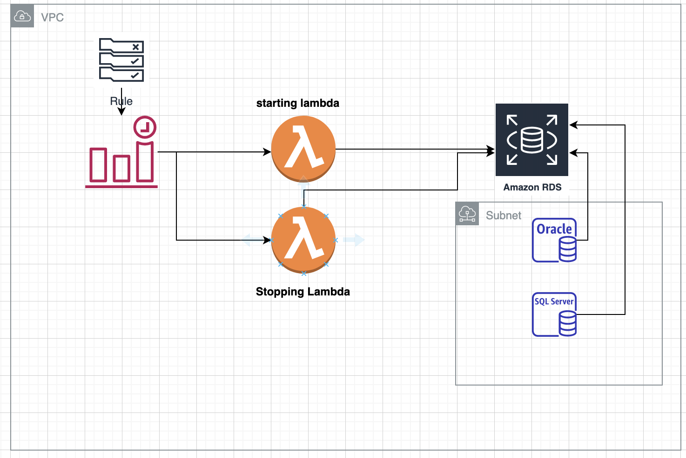

# Cost Optimisation for AWS Operations

 

## Goal achieved:
--------------

In recent engagement we got an opportunity to work with a client to
reduce their AWS operations cost of RDS and elastic compute by \$3000
per month.

Before our engagement their monthly expenditure was around \$4000 on RDS
and around \$1000 on EC2 services.

 

### Client's infrastructure before we get in to engagement:
-------------------------------------------------------

#### **RDS:**

- Five database were running where four were Oracle and one was SQL.
- Oracle and SQL instance were of size db.m4.xlarge and db.m5.xlarge.
- Current setup was running on demand which cost approx. 0.823\$ per hour per db.m5.xlarge instance.

#### **Elastic Compute:**

- Three instances were running with r5.xlarge configuration.
- These instances were associated with auto scaling group, hence in case of any crunch on instances, another instance will spin up.
 

### With our expertise, we consulted and worked on to :
----------------------------------------------------

#### **RDS:**

- Conduct performance testing on existing resources where we found out that it was consuming only 20% of vCPUs with more than 80% free memory.
- Reduce instance size after analysing CloudWatch logs post perf testing and as per best practices laid down for RDS.
- Reduce Snapshot retention period for non-critical application's databases to 2 days from 7 days.
- Migrate instances from on-demand to reserve with full upfront considering minimum running instances at time.
- Stop RDS instances during off-business hours. We achieved it using:
    - CloudWatch Event rules which will execute on every morning 8:00 am
    EST and evening 7:30 pm EST.
    - Two lambda function , one for starting RDS instances and another for
    stopping them.

 

#### **Elastic Compute:**

-   We studied application resources and reduced instance size using Prometheus ([https://prometheus.io/](https://prometheus.io/)).
-   Implemented resource in pod deployment in order to enable vertical/horizontal auto scaling in Kubernetes.
-   Reduce auto scaling minimum count from 5 to 3 for given node group.
-   Create different node groups for administrative pods/service and application pods in Kubernetes.

 
